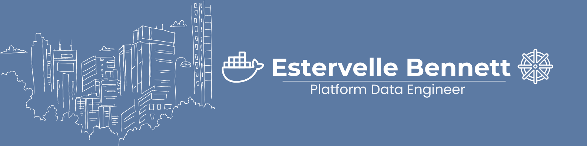

## 👋🏾 Hello!

I started my career as a **data engineer** building pipelines that moved and transformed data for analytics and reporting.  
Over time, those pipelines evolved into **full-fledged platforms**, and I found myself just as interested in the **infrastructure, orchestration, and automation** as the data itself.  

With the help of AI and a lot of reflection, I realized I think like a **system builder**:  
- How will this scale?  
- How will teams interact with it?  
- How can it run reliably without constant babysitting?  

That shift led me deeper into **platform engineering**, where I design containerized, cloud-native systems that are scalable, observable, and maintainable. My goal is to bridge the gap between **data engineering** and **infrastructure engineering**, delivering platforms that empower teams to focus on insights, not plumbing.

### 🔧 Tech I Work With:

### ⚙️ Featured Projects

#### Dockerized Lambda Data Platform  
8-container architecture simulating a lambda-style data flow — includes Kafka, FastAPI, Postgres, and monitoring stack.  
[View Project →](https://github.com/pyvel26/Lambda-Inspired-Platform)

#### Kubernetes Platform Migration - In Progress
Migrating the Lambda Data Platform from Docker Compose to Kubernetes (k3s) to explore:
- Pod orchestration and service mesh patterns
- Resource quotas and horizontal scaling
- ConfigMaps and persistent volume management
[View Project →](https://github.com/pyvel26/Kubernetes-Project)

### Contact & Links
- LinkedIn: [linkedin.com/in/estervelleb](https://linkedin.com/in/estervelleb)

---

🛠️ _This GitHub is my lab. I build, break, and rebuild to master platform engineering through real-world projects._
