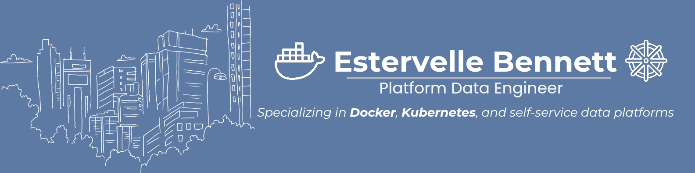

## 👋🏾 Hey, I'm Estervelle

I started as a **data engineer** and transitioned into **platform engineering** to design and manage scalable, containerized systems from the ground up.

I'm focused on building real-world projects that combine **data pipeline architecture** with **infrastructure, automation, and observability**.

### 🔧 Tech I Work With

### ⚙️ Featured Projects

#### Dockerized Lambda Data Platform  
8-container architecture simulating a lambda-style data flow — includes Kafka, FastAPI, Postgres, and monitoring stack.  
[View Project →](https://github.com/pyvel26/docker-lambda-data-platform)

#### Kubernetes Home Lab (AKS + Minikube) - in progress
Lightweight deployment of FastAPI + Postgres using Kubernetes. Includes readiness probes, resource limits, and CI/CD hooks.  

#### Observability Simulation - in progress
Custom-built logging & metrics pipelines that simulate real-world observability workflows.  

### Contact & Links
- LinkedIn: [linkedin.com/in/estervelleb](https://linkedin.com/in/estervelleb)

---

🛠️ _This GitHub is my lab. I build, break, and rebuild to master platform engineering through real-world projects._
